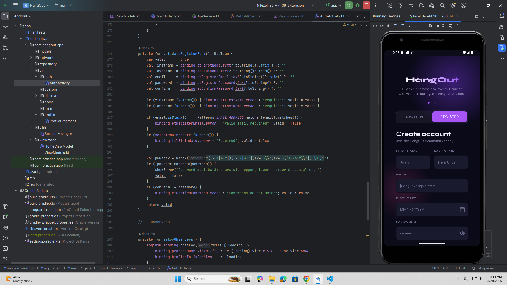
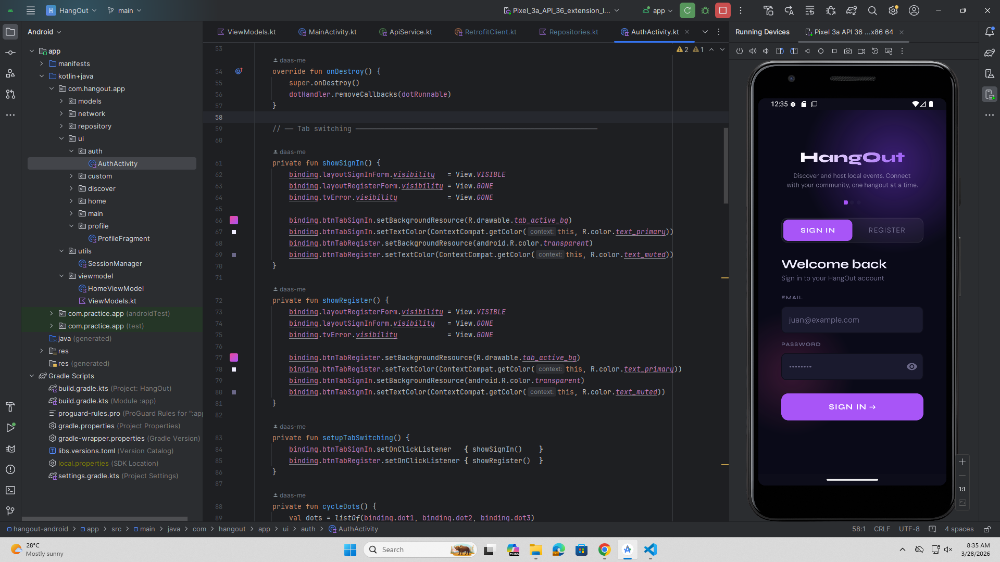
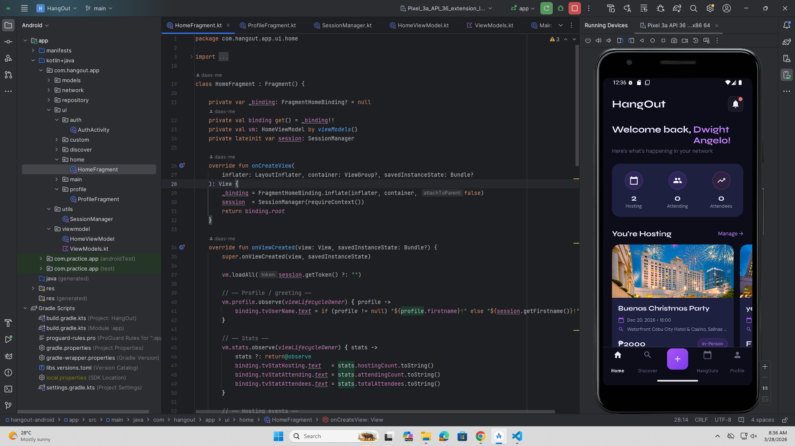
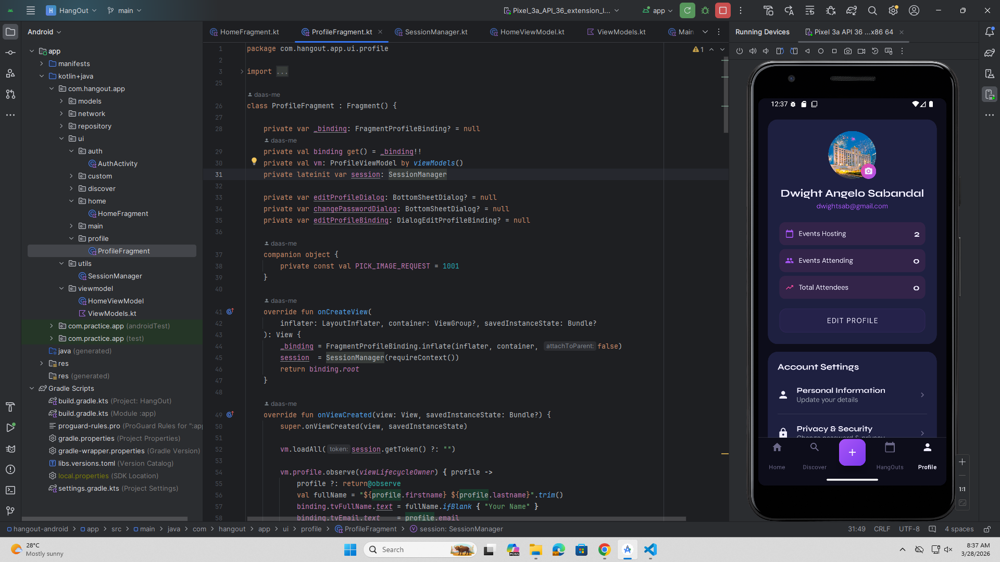
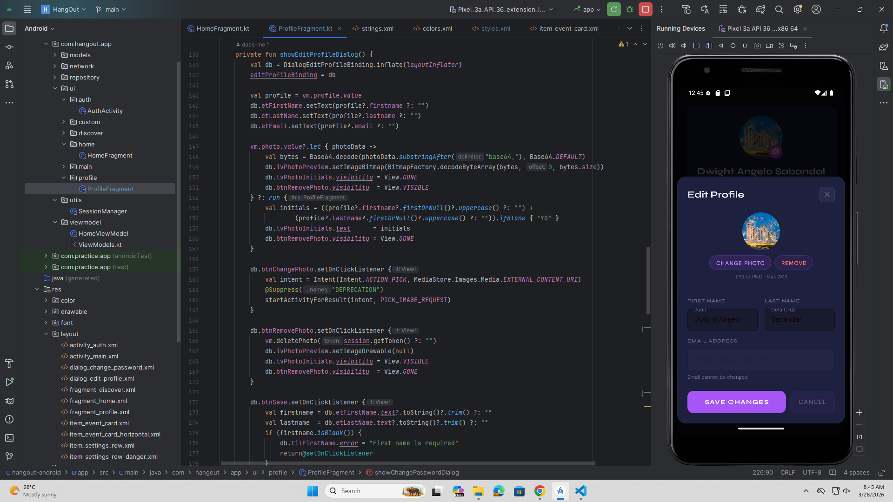
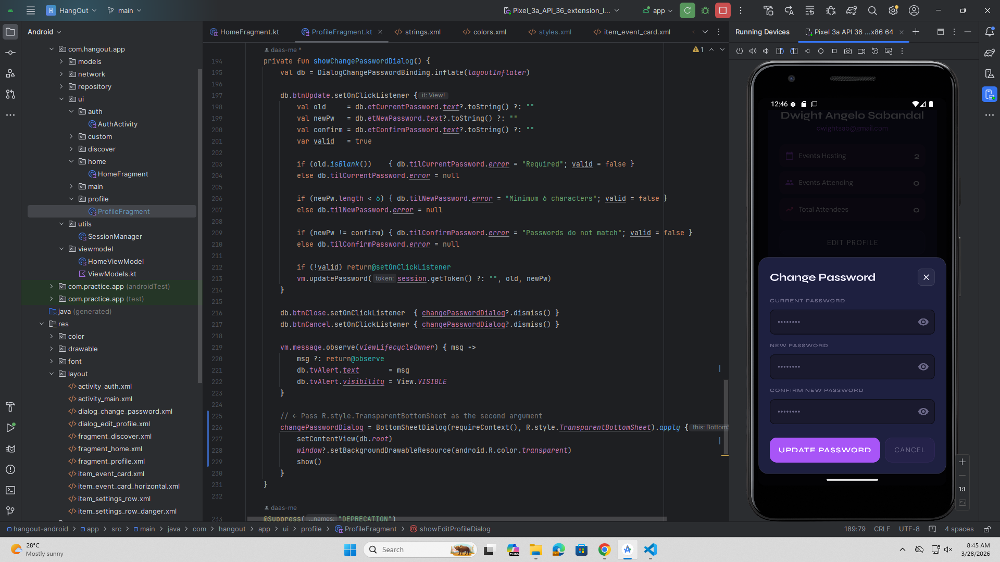

# HangOut Android App

A mobile app for discovering and hosting local events.

## Tech Stack
- Kotlin + MVVM architecture
- Retrofit + OkHttp for networking
- Spring Boot backend (shared with web app)
- Material Components UI

## Setup
1. Clone the repo
2. Open in Android Studio
3. Update `BASE_URL` in `RetrofitClient.kt`:
    - Emulator: `http://10.0.2.2:8080/api/`
    - Real device: `http://<your-local-ip>:8080/api/`
4. Run the Spring Boot backend
5. Build and run the app

## API Endpoints Used
| Method | Endpoint | Description |
|--------|----------|-------------|
| POST | /api/auth/login | User login |
| POST | /api/auth/register | User registration |
| GET | /api/user/profile | Get user profile |
| PUT | /api/user/profile | Update profile |
| PUT | /api/user/password | Change password |
| GET | /api/user/stats | Get event stats |
| GET | /api/events/hosting | Hosted events |
| GET | /api/events/today | Today's events |

## Screenshots
| Register | Login | Dashboard |
|----------|-------|-----------|
|  |  |  |

| Profile | Update Profile                         | Change Password |
|---------|----------------------------------------|-----------------|
|  |  |  |

## Error Handling
- No internet → "No internet connection. Please check your network."
- Invalid credentials → "Invalid email or password."
- Server error (500) → "Server error. Please try again later."
- Timeout → "Connection timed out. Please try again."